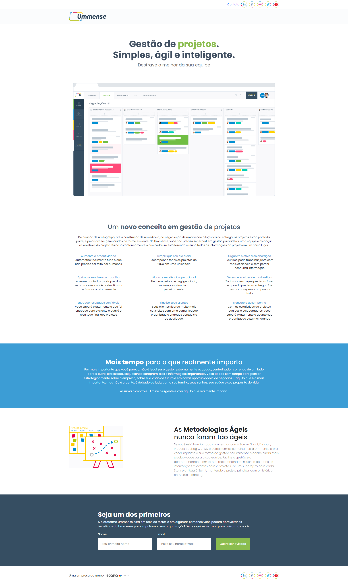
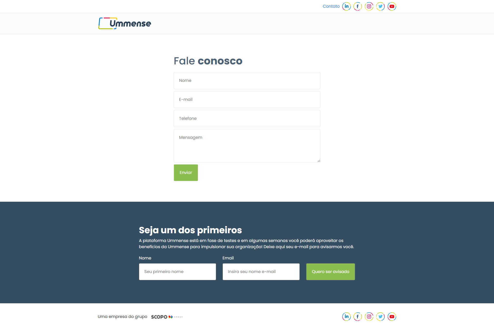

<h1 align='center'>CloneUmmense</h1>

  <a href="#rocket-tecnologias">Tecnologias</a>&nbsp;&nbsp;&nbsp;|&nbsp;&nbsp;&nbsp;
  <a href="#💻projeto">Projeto</a>&nbsp;&nbsp;&nbsp;|&nbsp;&nbsp;&nbsp;
  <a href="#💻instalacao">Instalação</a>
 

  
  

## :rocket: Tecnologias

Esse projeto foi desenvolvido com as seguintes tecnologias:

- [Angular 10](https://angular.io/)

## 💻 Projeto

Projeto (clone) feito apenas para mostrar minhas habilidades.

## 💻 Instalação

`npm  installl`

`ng server`

 

Feito com ♥ by ViniciusSoares 
=======
